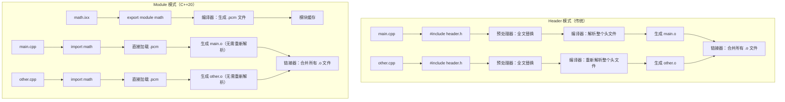

# C++ 有了 Namespace，为什么还需要 Module？

## 前言

在 C++ 的演进历程中，Namespace 早在 1998 年的 C++98 标准就已引入，而 Module 作为 C++20 的重磅特性姗姗来迟。这让不少开发者困惑：**Namespace 不是已经解决了命名冲突问题吗？为什么还要引入 Module？**

要回答这个问题，我们需要先理解 Namespace 的设计初衷，以及 Module 带来的根本性变革。

**背景补充**：C++20 奠定了 Module 基础，而 C++23 引入了标准库模块化（`import std;`）。需要说明的是：
- MSVC 在 C++20 模式下就提供了实验性支持（`import std.core`），C++23 提供正式的 `import std`
- GCC/Clang 的标准库模块化仍在实现中
这也是为什么现在（2024-2025 年）开始关注 Module 特别有意义。

***

## 一、Namespace 的本质：命名空间隔离

Namespace 的核心作用可以用一句话概括：**它只是一个命名空间隔离机制，用来解决命名冲突问题**。

```cpp
namespace Foo {
    void func() { /* ... */ }
}

namespace Bar {
    void func() { /* ... */ }
}

int main() {
    Foo::func();  // 明确指定调用哪个 func
    Bar::func();
    return 0;
}
```

Namespace 的出现，解决了"两个库都定义了同名类"这种命名冲突问题。但它本质上只是**给名字加了个前缀**，并没有改变编译单元的物理结构。

***

## 二、Namespace 的局限性

### 2.1 编译时不感知接口与实现

当我们 `#include <iostream>` 时：

- 预处理器把整个头文件内容**复制粘贴**到当前源文件
- 编译器需要解析所有这些代码
- 即使我们只用到其中一小部分功能

**"Header Hell"**指传统 C++ 头文件机制导致的编译缓慢、宏污染、循环依赖、重复编译等一系列问题。

### 2.2 分离编译模型固有的脆弱性

传统的 Header + Source 分离编译模式存在根本性缺陷：

| 特性   | 表现                        |
| ---- | ------------------------- |
| 重复编译 | 每个包含头文件的编译单元都要重新编译        |
| 前向声明 | 需要手动维护，容易出现不一致            |
| 宏污染  | Include 机制没有保护，可能污染整个翻译单元 |
| 依赖顺序 | 必须确保 Header 包含顺序正确        |

考虑一个经典问题：

```cpp
// a.h
struct A {
    void foo();  // 声明
};

// a.cpp
#include "a.h"
void A::foo() { /* 实现 */ }

// b.h
#include "a.h"
struct B {
    A a;  // 使用 A
};
```

如果 `a.h` 改变了，`b.h` 必须重新编译。即使只是把 `foo()` 的签名从 `void foo()` 改成 `void foo() const`，也可能引发级联编译。

### 2.3 Namespace 无法解决宏污染

```cpp
// library_a.h
#define max(a, b) ((a) > (b) ? (a) : (b))

// library_b.h
#define max(a, b) std::max(a, b)  // 冲突！
```

Namespace 可以隔离名字，但**无法隔离宏**。因为宏在预处理阶段展开，早于任何命名空间解析。

**Module 如何解决宏污染：**

```cpp
// 传统方式：Windows.h 的宏泄漏
#include <Windows.h>   // 定义了 min/max 宏
#include <algorithm>    // std::min/std::max
// 冲突！Windows.h 的宏会干扰 std::min/std::max
```

```cpp
// Module 方式：天然宏隔离
import std;            // std::min/std::max 安全使用
// Windows.h 的宏不会泄漏到 import std 的翻译单元
```

### 2.4 Module 不替代 Namespace：正交设计

**Module 和 Namespace 是正交的——Module 解决"如何编译"的问题，Namespace 解决"如何命名"的问题。**

**关键规则**：`::` 左边只可能是命名空间名（或类名），绝不可能是模块名。

```cpp
// module_a.ixx
export module A;
export void foo() { /* A 库的 foo */ }

// module_b.ixx
export module B;
export void foo() { /* B 库的 foo */ }

// main.cpp
import A;
import B;

int main() {
    foo();        // 错误！存在歧义
    A::foo();     // 错误！A 是模块名，模块名不能作为 :: 左侧
    return 0;
}
```

**澄清**：

- `A::foo()` 中的 `A` **不是模块名**——模块名不能出现在 `::` 左边
- 如果看到 `X::Y`，则 `X` 一定是命名空间名，不是模块名
- Module 本身不提供命名空间作用域

**模块导出的两种情况**：

| 导出方式 | 模块接口写法 | 消费者调用方式 |
|---------|------------|-------------|
| 顶层导出（无命名空间） | `export int square(int x);` | `square()`（直接访问） |
| 命名空间内导出 | `export namespace math { int square(int x); }` | `math::square()`（通过命名空间） |

**示例 1：模块 ≠ 命名空间（模块顶层导出）**

```cpp
// math.ixx
export module math;
export int square(int x) { return x * x; }

// main.cpp
import math;
int a = square(5);           // 正确：顶层导出，只能直接访问
int b = math::square(5);    // 错误！math 是模块名，不是命名空间
```

**示例 2：模块 = 命名空间（命名空间与模块名巧合相同）**

```cpp
// math.ixx
export module math;
export namespace math {     // 命名空间名碰巧也是 math
    int square(int x) { return x * x; }
}

// main.cpp
import math;
int a = math::square(5);     // 正确：math 是命名空间名
```

**实战技巧**：打开 `.ixx` 文件查看定义：
- 如果只有 `export module X;` 后紧跟 `export void foo();`（无 namespace）→ 只能写 `foo()`
- 如果有 `export namespace X { ... }` → 可以写 `X::entity`

**总结**：
- 模块名：出现在 `import 模块名` 或 `export module 模块名` 中
- 命名空间名：出现在 `namespace XXX` 或 `XXX::函数` 中
- `::` 左侧的标识符**永远是命名空间名**，模块名永远不可能出现在那里

### 2.5 头文件卫语句（Header Guard）的作用

传统的 Header 文件使用卫语句（Include Guard）防止重复包含：

```cpp
// mylib.h
#ifndef MYLIB_H
#define MYLIB_H

namespace mylib {
    class Foo { /* ... */ };
}

#endif
```

**卫语句的作用**：

1. **防止重复展开**：同一个头文件被多次 `#include` 时，只在第一次真正展开
2. **避免重定义错误**：否则会导致 `redefinition of class Foo` 编译错误
3. **解决循环包含**：A.h 包含 B.h，B.h 也包含 A.h（但有前置声明打破循环）

### 2.6 `#pragma once` 能替代卫语句吗？

```cpp
// mylib.h
#pragma once

namespace mylib {
    class Foo { /* ... */ };
}
```

**功能上**，两者都能防止同一个文件被重复展开，但有一些关键差异：

| 特性         | `#ifndef` 卫语句      | `#pragma once` |
| ---------- | ------------------ | -------------- |
| **标准**     | C++98 起，100% 移植    | 非标准（编译器扩展）     |
| **跨平台**    | 完美支持               | 主要编译器都支持，但非标准  |
| **重复包含检测** | 基于宏定义（检查 `MYLIB_H` 是否已定义） | 多因素判断（文件路径、inode、文件内容哈希等） |
| **符号硬链接**  | 可处理（宏名与文件系统无关）   | 通常能正确处理（编译器会综合判断） |
| **宏控制**    | 可灵活控制（如 `MYLIB_H`） | 无法灵活控制         |
| **代码可读性**  | 显式声明               | 简洁隐蔽           |

**补充说明**：

- 现代编译器对 `#pragma once` 的实现通常是**多因素判断**：文件路径（绝对路径）、文件 inode（Unix/Linux）、文件内容哈希（某些编译器）
- MSVC、GCC、Clang 都会考虑 inode（如果可用），硬链接问题确实存在，但现代编译器通常能正确处理

**建议**：

- 对**跨平台严肃项目**：坚持用 `#ifndef` 卫语句
- 对**简单内部项目**：`#pragma once` 更简洁
- **两者可以同时使用**（先检查 `#pragma once`，再检查卫语句）

***

## 三、Module 的革命性设计

C++20 引入的 Module 从根本上改变了编译模型：

### 3.1 编译单元的物理隔离

```cpp
// math.ixx (Module Interface Unit)
// 注意：.ixx 是 MSVC 的约定，GCC/Clang 通常使用 .cppm 或 .cxx
module;

export module math;

export namespace math {
    int square(int x) {
        return x * x;
    }

    constexpr double PI = 3.14159265358979;
}
```

**关于** **`module;`** **全局模块片段**：

上面代码中的 `module;` 是**全局模块片段**的声明，它的作用是：

- 标记全局模块片段的开始，在这个区域内可以使用 `#include` 引入传统头文件
- 这些内容**属于模块的私有实现细节**（在模块的内部可见），只是不会被 `export` 导出给消费者
- 关键区别在于：全局模块片段的内容对模块内部可见，但不会被 `export` 导出

**注意**：不能使用 `export #include <vector>`，而应在全局模块片段（`module;`）中引入传统头文件，确保头文件内容仅在模块内部可见，不会被导出。

**补充说明**：全局模块片段中定义的宏只在模块内有效，不会泄露给 `import` 者，这一点原文后续说对了，但前面的解释容易引起误解。

### 3.2 Module 的可见性控制

Module 提供了分层的可见性控制机制：

```cpp
export module math;

// 1. 完全导出：接口对消费者可见
export void public_func();

// 2. 仅模块内可见（模块链接）
void module_local_func();  // 不 export，当前模块内所有单元可见

// 3. 内部链接（文件级）
static void file_local_func();  // 传统 static，仅当前文件可见
```

Module 的可见性层级：
- **`export`**：模块接口，对 `import` 该模块的消费者可见
- **无 export**：模块内部，仅对同一模块的其他单元可见（模块链接）
- **`static`**：文件内部，仅对当前翻译单元可见（传统 C++ 语义）

```cpp
// main.cpp
import math;

int main() {
    int n = math::square(5);  // 正确：math 是命名空间名
    double pi = math::PI;     // 正确：math 是命名空间名
    return 0;
}
```

**Header 模式 vs Module 模式的编译流程对比：**



**关键差异**：Header 模式下，每个编译单元都要重新展开和解析头文件；而 Module 模式下，模块只编译一次生成 `.pcm` 缓存，后续编译单元直接加载。

### 3.3 核心优势一览

| 特性    | Header 模式      | Module 模式         |
| ----- | -------------- | ----------------- |
| 编译速度  | 慢（全文展开）        | **快（只导出接口）**      |
| 宏隔离   | 无法隔离           | **天然隔离**          |
| 依赖表达  | 隐式（通过 include） | **显式（通过 import）** |
| 接口一致性 | 分离维护容易出错       | **接口与实现一体**       |
| 符号重导出 | 困难             | **简单（re-export）** |

**关于宏隔离机制的详细说明**：

Module 的"天然宏隔离"体现在两个方向：

- **模块内 → 外**：模块内定义的宏**不会泄露**到 `import` 该模块的翻译单元
- **外 → 模块内**：外部宏（全局宏）**不会影响**模块内部的解析（除非通过全局模块片段 `module;` 引入传统头文件）

```cpp
// mymodule.ixx
#define MY_SECRET_MACRO 42  // 这个宏不会泄露给 import 者

export module mymodule;
export void foo() { /* 可以使用 MY_SECRET_MACRO */ }
```

```cpp
// main.cpp
import mymodule;
#define max(a,b) ((a)>(b)?(a):(b))  // 这个宏不会影响 mymodule 内部

mymodule::foo();  // 正常工作
```

**Module 对模板的友好支持**：

模板代码通常需在头文件中完整定义，导致重复实例化开销。Module 可优化这一点：

```cpp
// math.ixx
export module math;

export template<typename T>
T add(T a, T b) { return a + b; }

// 传统头文件模板：定义必须在头文件中，导致重复编译
// Module 模板：定义在接口单元，只编译一次，实例化缓存
```

模块内的模板仅需编译一次，导入时直接复用实例化结果，避免 Header 模式下多编译单元的重复实例化。

### 3.4 编译效率的质的飞跃

Module 的编译加速效果是惊人的。根据 C++ 标准委员会的研究：

- **编译速度提升可达 2-10 倍**（取决于项目结构）
- 增量编译时，未修改的 Module 不需要重新编译
- 避免了 Header 重复展开的开销

原因在于：Module 只编译一次，生成 `.pcm` (Module Cache File)，后续编译单元直接加载已编译好的模块表示，而非重新解析整个头文件。

### 3.5 接口单元与实现单元

Module 分为**接口单元（Interface Unit）和**实现单元（Implementation Unit），这是封装能力的关键：

```cpp
// math.ixx (Interface Unit - 接口单元)
export module math;

export int square(int x);    // 只导出声明
export constexpr double PI = 3.14159265358979;
```

```cpp
// math.cpp (Implementation Unit - 实现单元)
module math;                 // 不加 export，表示这是实现单元

int square(int x) {          // 实现细节完全隐藏
    return x * x;
}
```

**关键价值**：

- 实现单元中的代码变更**在理想情况下**不会触发消费者的重新编译
- 这是 Header 模式**无法做到的编译防火墙**（理论上）
- 消费者只需要重新编译接口单元，未修改的实现单元无需重新处理
- 实际上，某些编译器版本可能仍需要重新编译；内联函数、模板等在实现单元中的定义变更也可能需要重新编译

```cpp
// main.cpp
import math;

int main() {
    int n = square(4);  // 只依赖接口
    return 0;
}
```

如果 `math.cpp` 的实现变了（只要接口不变），`main.cpp` **理论上不需要重新编译**（具体行为取决于编译器实现）。

### 3.6 主流编译器支持现状（2024-2025）

| 编译器           | 支持程度   | 关键说明                                     |
| ------------- | ------ | ---------------------------------------- |
| **MSVC**      | 生产就绪 | 最佳 Module 支持；C++20 提供 `import std.core`，C++23 提供 `import std` |
| **GCC 14+**   | 支持   | 使用 `-fmodules-ts` 标志；标准库模块化进行中           |
| **Clang 18+** | 支持   | 支持良好；标准库模块化仍为实验性                         |

**模块文件扩展名差异**：

| 编译器   | 接口文件扩展名              | 实现文件扩展名      |
| ----- | -------------------- | ------------ |
| MSVC  | `.ixx`               | `.cpp`       |
| GCC   | `.cppm`、`.cc`、`.cxx` | `.cpp`、`.cc` |
| Clang | `.cppm`、`.cc`        | `.cpp`、`.cc` |

**关于** **`import std`**：这是 C++23 特性，C++20 中需要使用 `import std.core`（MSVC）或仍依赖传统头文件。

**Module 的构建系统支持**：

Module 的使用依赖构建系统显式处理模块依赖顺序（如先编译 math.ixx 再编译 main.cpp）：

| 构建系统      | Module 支持情况 |
| --------- | ----------- |
| CMake 3.28+ | 原生支持 C++20 Module |
| Build2     | 完整支持        |
| MSBuild    | MSVC 原生支持     |
| Bazel      | 实验性支持        |
| Ninja      | 逐步完善支持       |

***

## 四、为什么两者不能相互替换？

### 4.1 设计目标不同

| 维度        | Namespace | Module    |
| --------- | --------- | --------- |
| **解决的问题** | 命名冲突      | 编译效率 + 封装 |
| **引入版本**  | C++98     | C++20     |
| **作用层次**  | 名字层面      | 编译单元层面    |
| **核心价值**  | 组织代码逻辑    | 优化编译流程    |

**Namespace 是逻辑组织工具，Module 是物理编译工具。** 它们解决的是不同层次的问题。

### 4.2 Namespace 的不可替代性

Namespace 依然有其不可替代的价值：

1. **语义组织**：为相关功能提供逻辑分组，如 `std::vector`、`std::cout`
2. **ADL（Argument-Dependent Lookup）**：保障运算符重载的正确性
3. **无需修改代码结构**：可以在不改变原有代码的情况下添加命名空间

```cpp
namespace MyLib::Internal {  // 依然有用的嵌套命名空间
    namespace Details {
        // 实现细节，外部不可见
    }
}
```

**ADL 不可替代性示例**：

```cpp
namespace math {
    class Vector {};
    Vector operator+(const Vector&, const Vector&);
}

int main() {
    math::Vector v1, v2;
    auto v3 = v1 + v2;  // ADL 自动在 math 命名空间查找 operator+
}
```

说明：ADL 依赖 Namespace 实现运算符重载的自然查找，Module 无法替代此逻辑组织能力。

### 4.3 Module 与 Namespace 的结合使用

实际开发中，Module 常与 Namespace **配合使用**，既利用 Module 的编译效率，又保留 Namespace 的逻辑组织能力：

```cpp
// math.ixx
export module math;

export namespace math {  // 在模块内导出命名空间
    int square(int x) { return x * x; }
    double pi() { return 3.14159; }
}
```

```cpp
// main.cpp
import math;

int main() {
    int n = math::square(5);  // 通过命名空间访问
    double pi = math::pi();
    return 0;
}
```

**这种方式的优点**：

- **命名空间限定** `math::` 避免命名冲突（此处模块名与命名空间名恰好相同）
- **命名空间组织**提供语义化的 API 分组
- 未来可以将 `math` 模块的内容通过 `using namespace math` 引入，保留使用灵活性

### 4.4 子模块与分区（Partitions）

对于大型库，Module 支持\*\*分区（Partitions）\*\*来组织代码：

```cpp
// math:core.ixx (Partition - 核心分区)
export module math:core;      // 分区名格式：ModuleName:PartitionName
export int add(int a, int b) { return a + b; }
export int subtract(int a, int b) { return a - b; }
```

```cpp
// math:advanced.ixx (Partition - 高级分区)
export module math:advanced;
export int factorial(int n) { return n <= 1 ? 1 : n * factorial(n - 1); }
```

```cpp
// math.ixx (Primary Interface - 主接口)
export module math;
export import :core;          // 重新导出 core 分区
export import :advanced;       // 重新导出 advanced 分区
```

```cpp
// main.cpp
import math;                   // 获取 math 全部导出

int main() {
    math::add(1, 2);           // 来自 math:core
    math::factorial(5);        // 来自 math:advanced
    return 0;
}
```

**分区（Partitions）的价值**：

- 将大型模块拆分为多个物理文件，方便维护
- 只有主接口的导出才对消费者可见
- **这是 Namespace 无法实现的物理模块化能力**

### 4.5 Module 的不可替代性

Module 带来的能力是 Namespace 无法模拟的：

1. **编译防火墙**：实现细节完全对客户代码不可见
2. **真正的封装**：Header 模式理论上可以绕过（直接操作成员），Module 无法绕过
3. **可组合性**：`import std::ranges` 可以只导入需要的部分命名空间子集

```cpp
// Header 模式：理论上可以绕过封装
struct Foo {
    int secret;  // 任何拿到地址的代码都可以直接修改
};

// Module 模式：通过实现单元隐藏细节
// foo.ixx（接口单元）
export module foo;
export class Foo {
public:
    void doSomething();  // 仅导出接口
private:
    int secret;  // 声明可见，但访问受限（编译期保护）
};

// foo.cpp（实现单元）
module foo;
void Foo::doSomething() { /* 实现细节完全隐藏 */ }
```

若需彻底隐藏类布局，可结合 Pimpl 惯用法或仅在实现单元中定义非导出类。

***

## 五、实际使用场景对比

### 5.1 库的作者视角

**使用 Namespace + Header（传统方式）：**

```cpp
// mylib_export.h
#ifndef MYLIB_EXPORT_H
#define MYLIB_EXPORT_H

namespace mylib {
    class Foo {
    public:
        void doSomething();
    private:
        int hiddenState;  // 用户可以看到成员
    };
}

#endif
```

**使用 Module：**

```cpp
// mylib.ixx
export module mylib;

export class Foo {
public:
    void doSomething();
private:
    int hiddenState;  // 类定义完整导出，但访问受限
};
```

Module 模式下，**类的完整定义（包括所有成员）会被导出**，因为：

- `sizeof(Foo)` 和 `alignof(Foo)` 需要完整布局信息
- 模板实例化可能需要访问 `private` 类型

**但访问权限依然由** **`private`** **关键字保护**，用户无法直接访问 `hiddenState`（编译期错误）。如果希望实现"物理隐藏"（连定义都不暴露），应使用：

- **Pimpl 惯用法**（传统方式）
- **Module Implementation Unit**（C++20 实现单元）

### 5.2 库的消费者视角

```cpp
// 传统方式：必须理解整个 Header 结构
#include <mylib_export.h>
#include <other_dependency.h>  // 可能引入不必要的宏污染

// Module 方式：按需导入
import mylib;        // 只导入需要的
import std.core;     // 可选的精确子集
```

### 5.3 Module 的当前限制（现实检查）

尽管 Module 前景广阔，但在 2024-2025 年仍存在一些限制：

| 领域         | 当前状态                                       |
| ---------- | ------------------------------------------ |
| **编译器差异**  | GCC/Clang 的 Module 支持仍在完善中                |
| **标准库模块化** | `import std` 尚未全面可用，GCC/Clang 仍在实现       |
| **第三方库生态** | Boost、fmt 等主流库尚未 Module 化               |
| **IDE 支持**   | IntelliSense 对 Module 的支持仍在改进           |
| **调试体验**   | 某些调试器对 Module 的支持不如传统头文件              |
| **迁移路径**   | 现有代码库大规模迁移到 Module 需要时间和精力            |

**过渡期策略**：可以采用混合使用的方式，逐步引入 Module：

```cpp
// 混合使用场景（过渡期）
#include <legacy_header.h>  // 传统头文件
import modern_module;      // 新模块

// 注意：头文件中的宏不会影响模块，模块的导入是隔离的
```

***

***

## 六、展望：两者共存的时代

C++20 引入 Module 并不意味着 Namespace 的终结。**它们是互补的关系：**

- **Namespace**：继续用于代码的逻辑组织和语义分组
- **Module**：成为新的标准发布机制，解决编译效率和封装问题

可以预见，未来的 C++ 代码将是：

```cpp
import std;                    // Module 提供编译效率
using namespace std;            // Namespace 提供使用便利

namespace myapp::processors {  // Namespace 组织逻辑
    export class ImageProcessor { /* ... */ };  // export 修饰具体实体
}

// 或导出整个命名空间
export namespace myapp::processors {
    class ImageProcessor { /* ... */ };
}
```

***

## 结语

Namespace 和 Module 解决的是不同维度的问题：

- **Namespace** 是为了让人类更好地组织和管理代码名字
- **Module** 是为了让机器更高效地编译和处理代码单元

它们的关系不是"谁替代谁"，而是**各司其职、互补长短**。理解这一点，才能真正把握 C++ 模块化演进的方向。

***

> **延伸阅读**
>
> - C++20 标准文档中的 Module 章节
> - 《C++20 Fundamentals》- Module 详细介绍
> - MSVC/GCC/Clang 对 Module 的实验性支持情况

